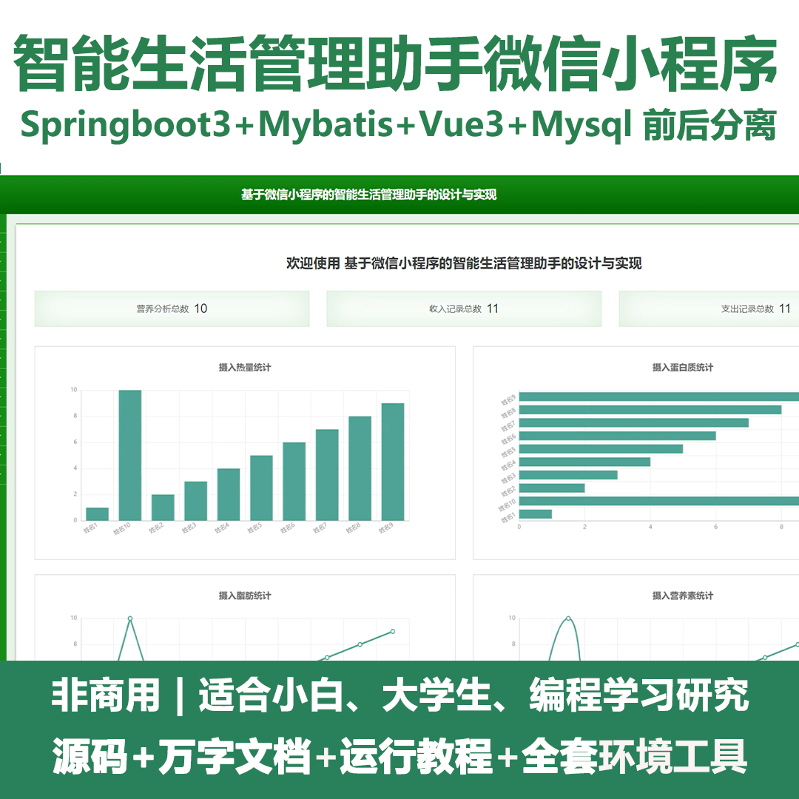
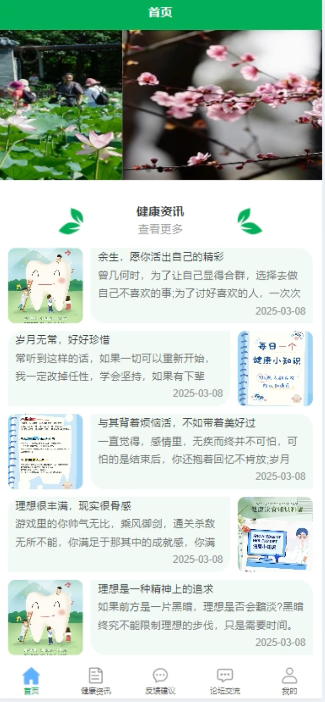
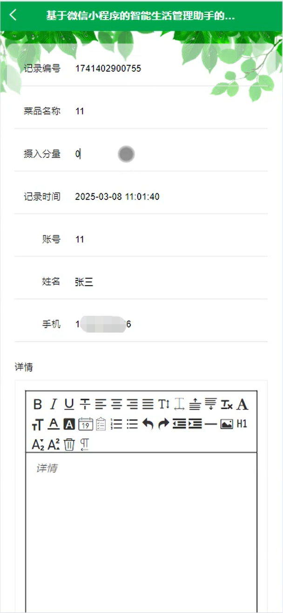
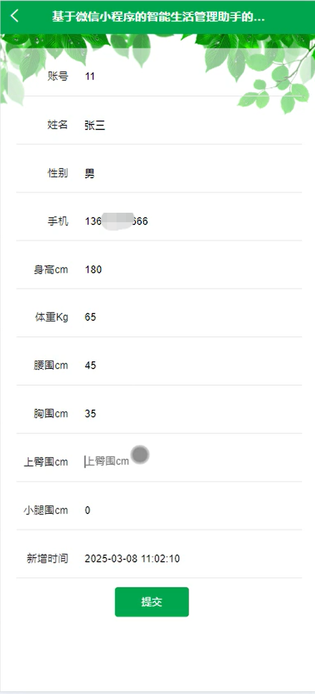
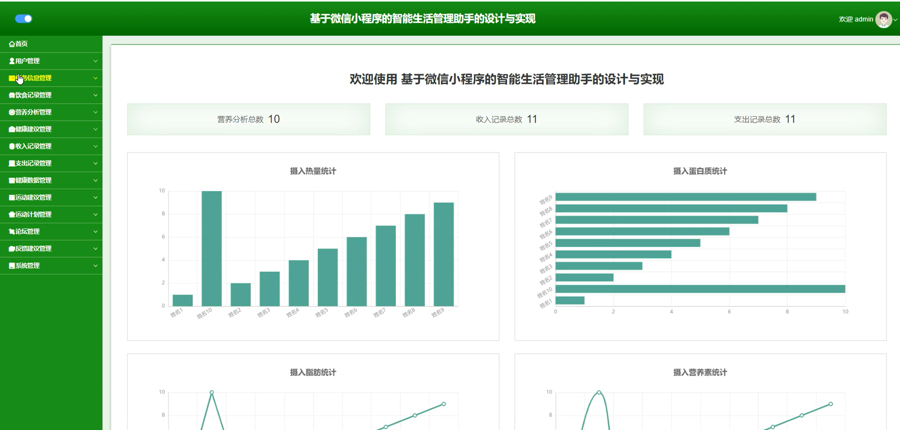
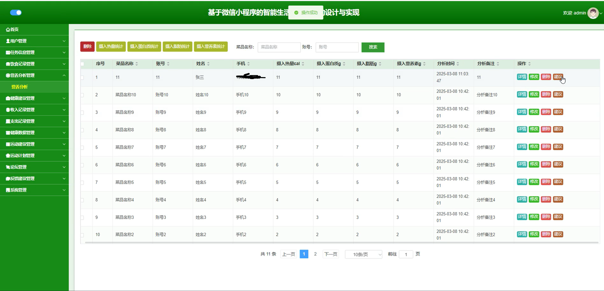
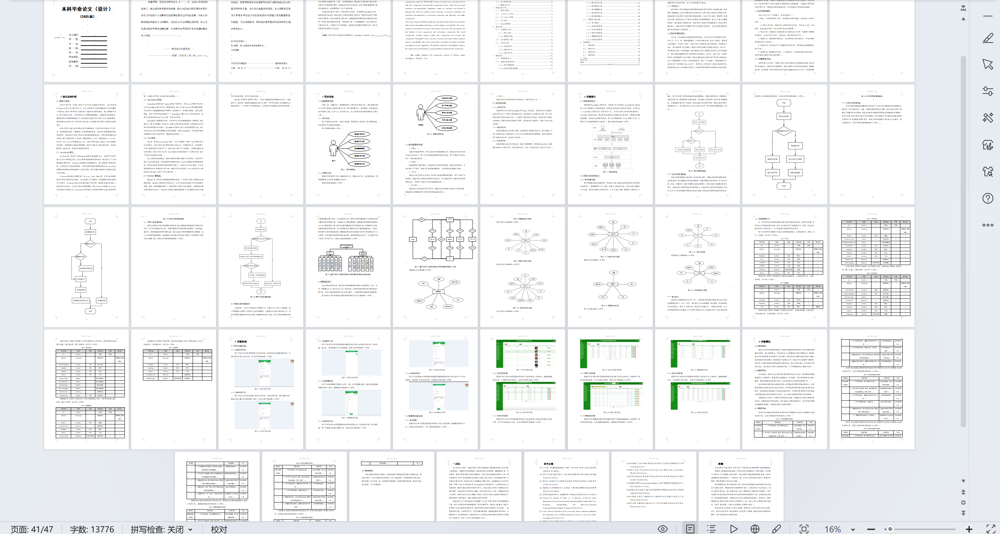

# mpweixinA227D
mpweixinA227D智能生活管理助手微信小程序+LW
 
## 源码问题查看主页咨询

### 一、关键词
健康管理、生活记录、社交互动

### 二、作品包含
源码+数据库+万字设计文档+全套环境和工具资源+本地部署教程

### 三、项目技术
前端技术： Html、Css、Js、Vue3.0、Element-plus
后端技术：Java、SpringBoot3.0、MyBatis

### 四、运行环境（以下版本亲测，其他版本兼容性请自行测试）
开发工具：IDEA/eclipse  + VSCODE + 微信开发者工具

数据库：MySQL5.7（最低要5.7版本）

数据库管理工具：Navicat10以上版本

环境配置软件： JDK17 + Maven3.6.3

前端Nodejs：20

浏览器：谷歌浏览器

### 五、项目介绍
项目编号：mpweixinA227

智能生活管理助手微信小程序是一款集成健康数据记录、营养分析、运动建议、财务记录、任务管理和社交互动功能的综合性生活管理工具。

角色：管理员、用户

管理员角色功能：
1. 用户管理：管理管理员和普通用户账号
2. 任务信息管理：管理系统任务信息
3. 饮食记录管理：管理用户饮食记录
4. 营养分析管理：管理营养数据分析，包括热量、蛋白质、脂肪等统计
5. 健康建议管理：管理健康建议内容
6. 收入记录管理：管理用户收入记录及统计
7. 支出记录管理：管理用户支出记录及统计
8. 健康数据管理：管理用户健康数据
9. 运动建议管理：管理运动建议内容
10. 运动计划管理：管理运动计划
11. 论坛管理：管理论坛交流内容
12. 反馈建议管理：管理用户反馈
13. 系统管理：管理轮播图、健康资讯、操作日志、弹窗提醒
用户角色功能：
1. 任务信息管理：管理个人任务
2. 饮食记录管理：记录和管理个人饮食
3. 营养分析管理：查看营养分析结果
4. 健康建议管理：查看健康建议
5. 收入记录管理：记录和管理个人收入
6. 支出记录管理：记录和管理个人支出
7. 健康数据管理：记录和管理个人健康数据
8. 运动建议管理：查看运动建议和制定计划
9. 运动计划管理：查看和管理个人运动计划
10. 论坛管理：管理个人发布的内容
11. 论坛交流：参与论坛互动
12. 反馈建议：提交反馈。

### 六、运行截图

